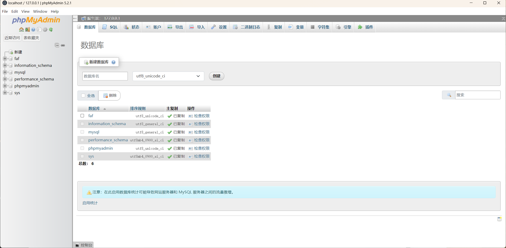

# PMAtron


PMAtron 是一款基于 Electron 的创新桌面应用，能在本地为你呈现完整的 phpMyAdmin 功能体验。它巧妙运用了 PHP-WASM 技术，让你无需传统 PHP 服务器环境即可直接享有 phpMyAdmin 的全部功能。



## ✨ 功能特色

PMAtron 为你重新定义使用 phpMyAdmin 的方式，带来：

- **零配置体验**：无需搭建任何 Web 服务器或 PHP 环境，即刻启动、使用 phpMyAdmin。
- **原生桌面体验**：以桌面应用形式运行，提供更顺畅、更直观的操作。
- **增强安全性**：自定义协议的实现，为传统浏览器访问方式提供更多安全保护层。
- **跨平台支持**：可在 Windows、macOS 和 Linux 上无缝运行。
- **离线能力**：即使在无网络环境下，也能对本地数据库进行访问与管理。
- **现代架构**：基于 Electron 与 PHP-WASM，提供高性能与高可靠性的稳定体验。

## 加入我们
加入我们的技术交流微信群！

如果你对 PMAtron 项目有兴趣，想了解更多技术细节、交流使用经验或参与社区贡献，欢迎扫码加入我们的技术交流微信群。


入群你将获得：

- 最新开发进度与版本更新信息
- 社区开发者的经验分享与技术答疑
- 使用技巧、BUG 反馈、功能建议的讨论平台
- 第一时间参与社区活动与新特性测试

请在加群时备注你的 GitHub 用户名或关注的方向，以便我们更好地为你提供帮助。

## 🚀 快速开始

运行 PMAtron 非常简单：

```bash
# 克隆仓库
git clone https://github.com/maskerprc/pmatron.git

# 进入项目目录
cd pmatron

# 安装依赖
npm install

# 启动应用程序
npm start
```

## 🗺️ 开发路线图

我们的开发计划分为三个阶段：

### 阶段一：基础（2024 年第 1 季度）
- 基础版本发布，提供基本的 phpMyAdmin 功能
- 跨平台测试与稳定性提升
- 基于 PHP-WASM 的核心功能实现

### 阶段二：增强（2024 年第 2 季度）
- 提供高级的数据库管理功能
- 支持自定义主题
- 性能优化
- 自动更新系统集成

### 阶段三：创新（2024 年第 3 季度）
- 插件系统，便于功能拓展
- 改进自定义协议处理方式
- 增强安全功能
- 社区驱动的功能开发与完善

## 🤝 欢迎贡献

我们非常欢迎社区贡献！你可以通过以下方式参与到 PMAtron 的建设中：

### 开发流程
1. Fork 本仓库
2. 创建分支以添加新特性（`git checkout -b feature/AmazingFeature`）
3. 提交你的改动（`git commit -m 'Add some AmazingFeature'`）
4. 推送到远程分支（`git push origin feature/AmazingFeature`）
5. 发起 Pull Request

### 开发环境搭建

```bash
# 安装开发依赖
npm install --dev

# 运行测试
npm test

# 构建生产版本
npm run build
```

### 代码规范
- 遵循现有的代码风格
- 使用有意义的变量与函数命名
- 对复杂逻辑添加必要的注释
- 为新增特性编写测试

## 📈 项目成长轨迹

[](https://star-history.com/#MaskerPRC/pmatron&Date)

自项目诞生以来，得益于出色的社区成员与用户，我们的星标与关注度持续增长。

## 🙏 致谢

PMAtron 的成长离不开众多优秀项目与社区的贡献与支持：

- 感谢 phpMyAdmin 团队提供出色的数据库管理工具
- 感谢 Electron 团队，让跨平台桌面应用成为可能
- 感谢 PHP-WASM 项目，为我们带来在浏览器环境中运行 PHP 的新思路
- 感谢所有为 PMAtron 做出贡献的开发者与社区成员
- 感谢每一位为本项目加星标、Fork 或反馈问题的用户

## 📄 授权许可

PMAtron 在 MIT 许可下发布。详情请查看 [LICENSE](LICENSE) 文件。

---

<div align="center">
以 ❤️ 倾注的 PMAtron 团队
</div>
