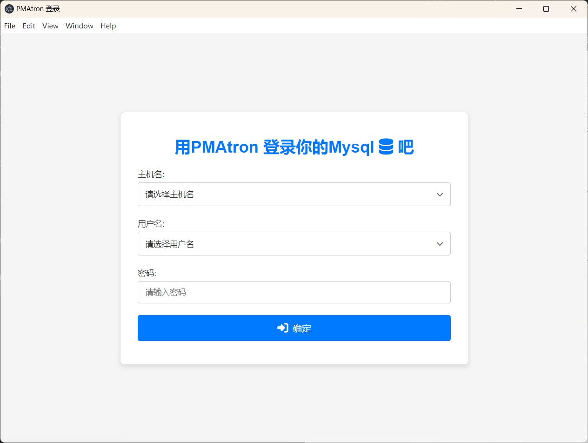

# PMAtron


PMAtron is an innovative Electron-based application that brings phpMyAdmin to your desktop with enhanced capabilities and a seamless user experience. By leveraging PHP-WASM technology, it eliminates the need for a traditional PHP server setup while maintaining full phpMyAdmin functionality.



## ✨ Features

PMAtron transforms how you interact with phpMyAdmin by offering:

- **Zero Configuration**: Launch and run phpMyAdmin instantly without setting up a web server or PHP environment
- **Native Experience**: Enjoy phpMyAdmin as a desktop application with native system integration
- **Enhanced Security**: Custom protocol implementation provides additional security layers compared to traditional web-based access
- **Cross-Platform**: Works seamlessly on Windows, macOS, and Linux
- **Offline Capability**: Access and manage your databases without an internet connection
- **Modern Architecture**: Built on Electron and PHP-WASM for optimal performance and reliability

## 🚀 Getting Started

Running PMAtron is straightforward:

```bash
# Clone the repository
git clone https://github.com/maskerprc/pmatron.git

# Navigate to the project directory
cd pmatron

# Install dependencies
npm install

# Launch the application
npm start
```

## 🗺️ Roadmap

Our development journey is guided by these key milestones:

### Phase 1: Foundation (Q1 2024)
- Initial release with basic phpMyAdmin functionality
- Cross-platform testing and stability improvements
- Core feature implementation using PHP-WASM

### Phase 2: Enhancement (Q2 2024)
- Advanced database management capabilities
- Custom theming support
- Performance optimizations
- Automated update system

### Phase 3: Innovation (Q3 2024)
- Plugin system for extending functionality
- Custom protocol handler improvements
- Enhanced security features
- Community-driven feature development

## 🤝 Contributing

We welcome contributions from the community! Here's how you can help make PMAtron better:

### Development Process
1. Fork the repository
2. Create a feature branch (`git checkout -b feature/AmazingFeature`)
3. Commit your changes (`git commit -m 'Add some AmazingFeature'`)
4. Push to the branch (`git push origin feature/AmazingFeature`)
5. Open a Pull Request

### Setting Up Development Environment

```bash
# Install development dependencies
npm install --dev

# Run tests
npm test

# Build for production
npm run build
```

### Code Style
- Follow the existing code style
- Use meaningful variable and function names
- Add comments for complex logic
- Write tests for new features

## 📈 Project Growth

<div align="center">
    
</div>

Our project has seen steady growth since its inception, thanks to our amazing community of contributors and users.

## 🙏 Acknowledgements

PMAtron stands on the shoulders of giants. Special thanks to:

- The phpMyAdmin team for their incredible database management tool
- The Electron team for enabling cross-platform desktop applications
- The PHP-WASM project for making PHP run in the browser
- Our contributors and community members who help improve PMAtron
- Everyone who has starred, forked, or reported issues

## 📄 License

PMAtron is released under the MIT License. See the [LICENSE](LICENSE) file for more details.

---

<div align="center">
Made with ❤️ by the PMAtron Team
</div>
